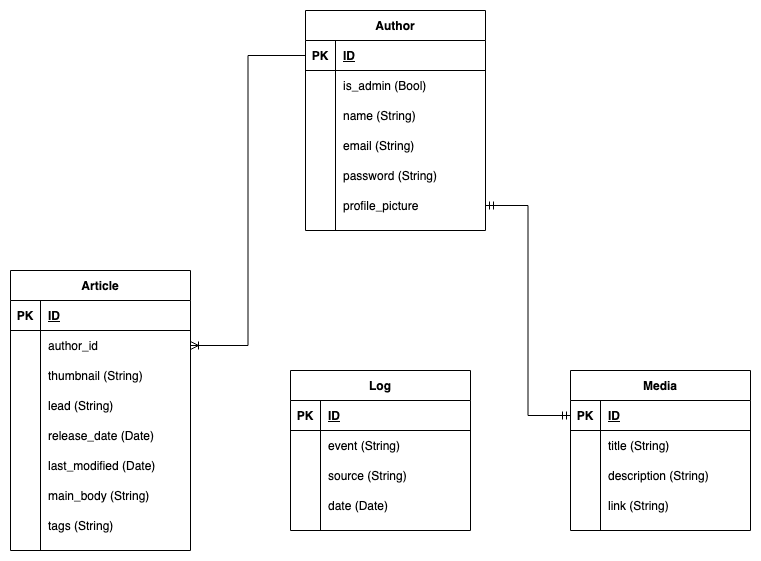

# pusztulat.hu
news site

# Requirements

* landing page

    * thumbnails of articles
    * admin can modify

* article page

    * thumbnail
    * lead + head
    * main body
    * tags

* author/admin interface

    * sign in

* search

    * tags

* multimedia storage

# Technologies Used

* Java-EE backend
* Angular frontend

# Database

<h2 align="center">

</h2>

The backend for this project can be found at [pusztulat_backend](https://github.com/acsibacsi/pusztulat_backend)
